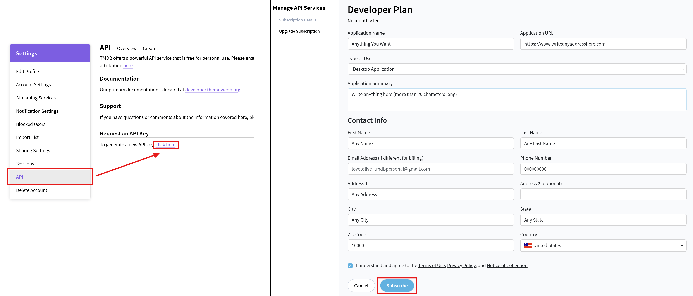
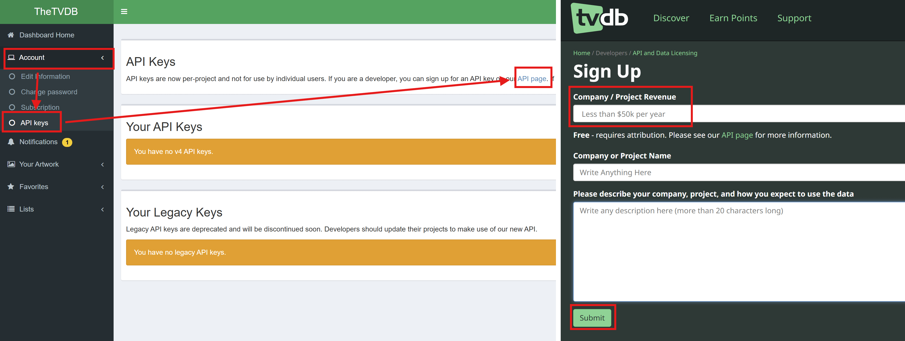

# 📝 1. Khế Ước Thiêng Liêng

Đầu tiên, hãy bắt đầu bằng việc thiết lập các "viên gạch" nền móng – đó là tạo các tài khoản cần thiết:

## I. **Stremio**
Tất nhiên rồi, phải bắt đầu bằng việc tạo một tài khoản [**Stremio**](https://www.stremio.com) miễn phí.

>## II. **Thư viện phim** *(Tùy chọn, có thể tạo hoặc không)*
>**<mark>Các trang này được sử dụng với add-on để nâng cao trải nghiệm người dùng:</mark>**
 >* Cung cấp thêm thông tin về phim như mô tả nội dung, diễn viên, đạo diễn, v.v
 >* Tạo các danh mục phim mở rộng, danh sách gợi ý theo sở thích hoặc danh sách phim của riêng bạn.
 >* Đây là bước hoàn toàn **<mark2>tùy chọn,</mark2>**, bạn có thể bỏ qua nếu chỉ muốn xem phim nhanh.
 
1. **<mark>IMDb:</mark>** Tạo một tài khoản [**IMDb**](https://www.imdb.com/) miễn phí
   * *Trang cung cấp thông tin và chấm điểm phim với lượng người dùng đông đảo*

2. **<mark>TMDB:</mark>** Tạo tài khoản [**TMDB**](https://www.themoviedb.org/) và lấy mã API miễn phí:
   * *TMDB cung cấp dữ liệu (mô tả, diễn viên...) cho phim điện ảnh.*
   a. Nhấn vào biểu tượng hồ sơ ở góc trên bên phải, chọn "**<mark2>Settings</mark2>**".
   b. Chọn mục "**<mark2>API</mark2>**" ở cột bên trái.
   c. Tại phần "**<mark2>Request an API Key</mark2>**", nhấn vào dòng chữ "*<mark2>click here</mark2>*".
   d. Chọn "**<mark2>Yes</mark2>**" khi được hỏi mục đích sử dụng cá nhân.
   e. Điền thông tin vào biểu mẫu (không nhất thiết phải chính xác 100%) và nhấn "**<mark2>Subscribe</mark2>**".
   f. Sau đó, lưu lại mã "**<mark2>API Read Access Token</mark2>**" và "**<mark2>API Key</mark2>**".

   

3. **<mark>TVDB:</mark>** Tạo tài khoản [**TVDB**](https://www.thetvdb.com/) và lấy mã API miễn phí:
   * *TVDB cung cấp dữ liệu chuyên sâu cho các phim bộ (Series).*
   a. Sau khi đăng nhập, truy cập trang [**<mark2>API Information</mark2>**](https://www.thetvdb.com/api-information).
   b. Chọn bất kỳ tùy chọn nào trong danh sách hiện ra và nhấn "**<mark2>Save</mark2>**".
   c. Nhấn "**<mark2>Get Started</mark2>**".
   d. Đảm bảo chọn mục "**<mark2>Less than $50k per year</mark2>**", điền các thông tin khác tùy ý và nhấn "**<mark2>Submit</mark2>**".
   e. Copy mã API hiện ra ở trang thông báo thành công.

   

4. **<mark>Trakt:</mark>** Tạo một tài khoản [**Trakt**](http://www.trakt.tv) miễn phí
   * Đây là trợ thủ đắc lực để theo dõi tiến trình xem phim và tạo các danh sách tùy chỉnh, giúp Stremio trông chuyên nghiệp không kém gì Netflix. Nếu là tài khoản mới, hãy chịu khó đánh dấu "đã xem" ít nhất 10 phim điện ảnh và 10 phim bộ để các danh sách tùy chỉnh có thể hoạt động.
   * Trong cẩm nang này, chúng ta sử dụng **<mark2>Trakt</mark2>** làm công cụ theo dõi nội dung mặc định, chủ yếu vì nó được Stremio hỗ trợ "tận răng". Khi bật tính năng **<mark2>Trakt Scrobbling</mark2>** trong phần cài đặt của Stremio, ứng dụng sẽ tự động gửi lịch sử và tiến trình xem phim tới Trakt. Từ đó, bạn có thể tự tạo danh sách phim riêng hoặc quản lý thư viện cá nhân theo sở thích. 
   * Tuy nhiên, gần đây Trakt bắt đầu thắt chặt giới hạn truy cập (rate limits) và hạn chế khá nhiều tính năng đối với tài khoản miễn phí. Điều này dẫn đến việc thỉnh thoảng bạn sẽ gặp lỗi không đồng bộ được. Vì vậy, bên dưới cũng cung cấp các giải pháp thay thế để tăng tính linh hoạt và ổn định.
   * **<mark2>Lưu ý nhỏ:</mark2>** Khác với Trakt, Stremio không tự đồng bộ trực tiếp với các nền tảng này, chúng ta sẽ dùng add-on **<mark2>AIOMetadata</mark2>** để làm thay việc đó. Khi bạn mở một luồng phim, AIOMetadata sẽ sử dụng tính năng *check-in* để đánh dấu bạn đã bắt đầu xem, và khi phim kết thúc, nó sẽ đánh dấu là đã xem xong. Mọi thứ diễn ra tự động để đảm bảo lịch sử xem của bạn luôn liền mạch.

5. **<mark>MDBList</mark>**: Hoàn hảo để khám phá các danh mục do người dùng tự tổng hợp.*
   a. Tạo tài khoản trên [**MDBList**](https://mdblist.com/). (*Bạn có thể đăng ký bằng tài khoản Trakt sẵn có để MDBList tự động đồng bộ và cập nhật lịch sử từ Trakt qua*).
   b. Nhấn vào tên hồ sơ của bạn ở góc trên bên phải, chọn "**<mark2>Connected Accounts</mark2>**".
   c. Tại trang **<mark2>Preferences</mark2>**, nhấn vào nút "**<mark2>API Access</mark2>**" trong menu và copy đoạn mã **<mark2>API Key</mark2>**.
   d. Đăng nhập vào **<mark2>AIOMetadata</mark2>** bằng **<mark2>UUID</mark2>** và **<mark2>Password</mark2>** của bạn, sau đó chuyển sang tab **<mark2>Integrations</mark2>**.
   e. Dán mã vừa copy vào ô **<mark2>MDBList API Key</mark2>**.
   f. Tại tab **<mark2>General</mark2>**, đảm bảo mục "**<mark2>MDBList Watch Tracking</mark2>**" đã được bật.
   g. Chuyển sang tab **<mark2>Catalogs</mark2>**, nhấn vào biểu tượng **<mark2>MDBList</mark2>** (nằm cạnh biểu tượng Trakt).
   h. Nhập lại mã **<mark2>API Key</mark2>** vào đó một lần nữa.
   i. Nhấn "**<mark2>Save & Close</mark2>**", sắp xếp lại vị trí các danh mục theo ý thích, và đừng quên nhấn **<mark2>Save</mark2>** ở tab **<mark2>Configuration</mark2>** để lưu lại toàn bộ thay đổi.

6. **<mark>Simkl</mark>**: Trải nghiệm tương tự Trakt nhưng linh hoạt hơn trong việc quản lý lịch sử xem.
   * Bạn có thể dùng song song với Trakt để tối ưu hóa sở thích cá nhân.
   a. Tạo tài khoản trên [**Simkl**](https://simkl.com/).
   b. Bạn có thể chọn nhập (import) lịch sử từ **Trakt** sang nếu muốn.
   c. Sau khi tài khoản đã sẵn sàng, đăng nhập vào **<mark2>AIOMetadata</mark2>** bằng **<mark2>UUID</mark2>** và **<mark2>Password</mark2>**.
   d. Tại tab **<mark2>General</mark2>**, hãy đảm bảo mục "**<mark2>Simkl Checkin</mark2>**" đã được bật.
   e. Chuyển sang tab **<mark2>Catalogs</mark2>**, nhấn vào biểu tượng **<mark2>Simkl</mark2>** cạnh biểu tượng Trakt.
   f. Làm theo hướng dẫn trên màn hình để kết nối tài khoản Simkl của bạn.
   g. Bạn có thể thêm bất kỳ danh mục phim nào mình thích ngay tại trang đó, sau đó nhấn "**<mark2>Close</mark2>**".
   h. Sắp xếp lại thứ tự các danh mục mới và đừng quên nhấn **<mark2>Save</mark2>** ở tab **<mark2>Configuration</mark2>** để hoàn tất.

