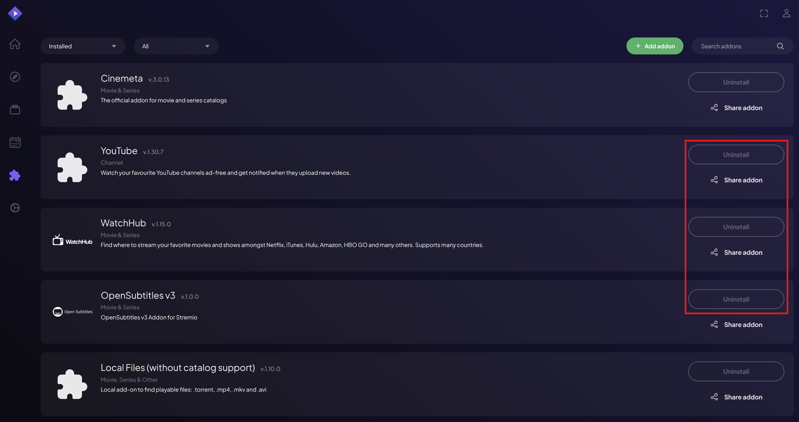

# ⚙️ 2. Cài đặt và thiết lập ban đầu cho Stremio

## I. Cài đặt phần mềm/app Stremio
### 1. Windows, macOS, Linux
Tải tại trang [**Stremio Download**](https://www.stremio.com/downloads)
### 2. Các thiết bị có app chính thức
Cài đặt app **<mark>Stremio</mark>** từ Store. Xem thêm tại trang [**Stremio Download**](https://www.stremio.com/downloads)
### 3. iPhone & iPad
>* Trước tiên cài đặt app **<mark2>VLC</mark2>** hoặc **<mark2>Outplayer</mark2>** để phát video.
>* Mở [**Stremio Web**](https://web.stremio.com) bằng trình duyệt
>* Bấm **<mark2>“Don't show again”</mark2>** để tắt thông báo **<mark2>“Streaming server is not available”</mark2>**
>* **<mark>iPad phải làm thêm bước này:</mark>** Vào cài đặt trang web, bấm **<mark2>“Yêu cầu trang web cho thiết bị di dộng”</mark2>**
>* Thêm Stremio vào màn hình chính để tiện sử dụng và đăng nhập từ đó.
>* Bấm vào avatar và vào phần **<mark2>Settings.</mark2>**
>* Lướt xuống tới phần **<mark2>Play in external player.</mark2>** Chọn **<mark2>VLC</mark2>** hoặc **<mark2>Outplayer</mark2>**
>   * **<mark2>VLC:</mark2>** Điều chỉnh được tốc độ phát
>   * **<mark2>Outplayer:</mark2>** Không điều chỉnh được tốc độ phát với bản miễn phí
>* Xem hướng dẫn có hình ảnh [**tại đây**](https://troypoint.com/stremio-on-ios/)
### 4. TV Samsung/LG không có app Stremio
>* Cài đặt app **<mark2>Media Station X</mark2>** từ Store.
>* Vào Settings → Validate Links → No
>* Vào Settings → Start Parameter → Setup
>* Bấm nút **<mark2>🔒</mark2>** rồi nhập **<mark2>bartche.github.io</mark2>**
>* Bấm nút **<mark2>✔️</mark2>** để lưu, hiện ra gì thì bấm **<mark2>Yes.</mark2>**
>* Xem hướng dẫn có hình ảnh [**tại đây**](https://github.com/bartche/msx/)
### 5. TV và thiết bị Android cài từ Store hoặc apk
> **<mark2>Nếu gặp lỗi giật lag khi xem thì làm như sau:</mark2>**
>* Gỡ bản đã cài đặt trước đó
>* Tải và cài đặt phiên bản **<mark2>Stremio 1.6.12</mark2>**, dùng 1 trong 2 cách sau:
>   * Tải bằng máy tính/điện thoại với [**link này**](https://dl.strem.io/android/v1.6.12-com.stremio.one/com.stremio.one-1.6.12-11049190-armeabi-v7a.apk) rồi gửi qua TV bằng app Local Send: 
>   * Tải bằng app **<mark2>Downloader by AFTVnews</mark2>** với code **<mark2>259421</mark2>**
### 6. Các phần mềm/app thay thế khác
Đi tới [🧿 Điện Thờ Hiền Triết](guide/7-Additional-Stuff.md)
## II. Thiết lập ban đầu cho Stremio:
### 1. **Đăng nhập vào Stremio Web hoặc phần mềm Stremio**
   * Mở [**Stremio Web**](https://web.stremio.com) hoặc phần mềm **<mark2>Stremio</mark2>** và đăng nhập vào tài khoản của bạn.
   * **<mark>LƯU Ý CỰC KỲ QUAN TRỌNG</mark>**: Đừng nhầm lẫn giữa trang [*stremio.com*](https://www.stremio.com) và [*web.stremio.com*](https://web.stremio.com) (nơi bạn **<mark2>BẮT BUỘC</mark2>** phải đăng nhập để cài đặt hoặc gỡ bỏ addon).
   * Trang chủ Stremio dùng để quản lý và liên kết tài khoản với các thiết bị đăng nhập bằng QR Code.
   * Trang Web giao diện dùng để quản lý addon.
   * Sau khi bạn thiết lập xong **<mark2>MỘT LẦN DUY NHẤT</mark2>**, hệ thống sẽ tự động đồng bộ và hoạt động trên mọi thiết bị bạn dùng (Smart TV, Android, iOS, Windows...).

   

### 2. **Dọn dẹp Addon**
   * Vào mục **<mark2>Addons</mark2>** và gỡ cài đặt (uninstall) **<mark2>TẤT CẢ</mark2>** các addon sẵn có.
   * *Riêng **<mark2>Cinemeta</mark2>** và **<mark2>Local Files</mark2>** là hai addon mặc định của hệ thống nên không thể xóa được. Cứ kệ đó để xử lý sau.*

   

### 3. **Kích hoạt đồng bộ Trakt**
   * *Bỏ qua nếu không có nhu cầu sử dụng. Bước này giúp Stremio tự động gửi lịch sử và tiến trình xem phim của bạn lên Trakt để lưu trữ.*
   * Vào mục **<mark2>Account Settings</mark2>** trong trang quản lý [**Stremio Account**](https://www.stremio.com) và bật tính năng **<mark2>Trakt Scrobbling</mark2>** bằng cách kết nối với tài khoản Trakt của bạn.

