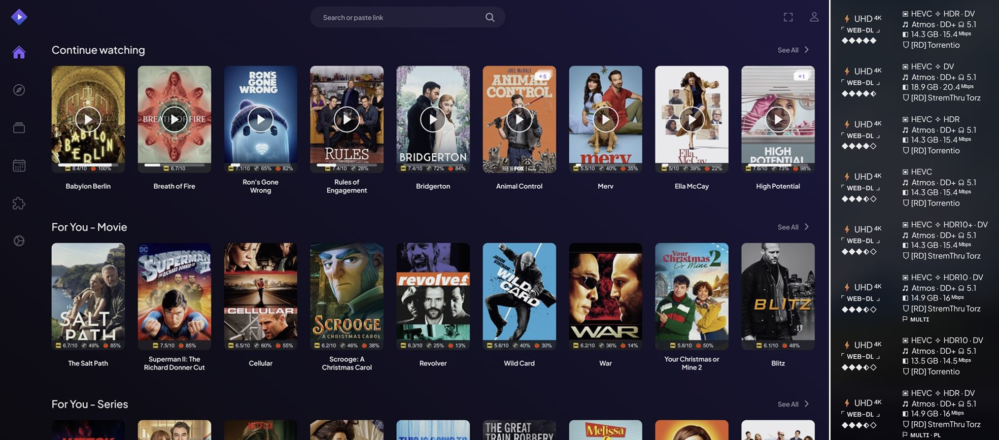

# 🎬 CẨM NANG NẮM GIỮ THỰC TẠI ĐIỆN ẢNH 🎬
## **[❤️ From BimBip & luckynumb3rs with love ❤️]** 

Sau nhiều lần thử nghiệm cũng như kiểm tra các Addon khác nhau, thằng bạn mình đã đạt được thiết lập Stremio tối ưu, bạn có thể xem [ở đây](https://luckynumb3rs.github.io/stremio-perfect-setup/). Mặc dù trông có vẻ là một hướng dẫn rất dài, nhưng thực ra nó rất dễ thực hiện vì được trình bày kỹ lưỡng và mô tả mọi thứ chi tiết từng bước một. Khi đọc qua một lượt, bạn sẽ thấy những cài đặt này tùy thuộc vào sở thích và mỗi người có những ưu tiên khác nhau, cần dùng hoặc không.

Nhằm giúp mọi người làm quen với Stremio thật nhanh và sử dụng được ngay Addon MCUDISVN, Chef Bìm Bịp đã chọn lọc thông tin và chế tạo ra <b><i><mark>Cine-Gauntlet - Găng Tay Điện Ảnh.</mark></i></b> Đây là công cụ giúp bạn nắm giữ 6 "viên đá" cần thiết để làm chủ thực tại điện ảnh Stremio. Hãy bắt đầu với những hướng dẫn dễ dàng và dễ hiểu nhất rồi sau đó tự điều chỉnh bất kỳ thay đổi nào bạn muốn. 😊

>## **CHÚ Ý:**
>* Nếu bạn **<mark2>vừa mới biết đến Stremio</mark2>** và cần **<mark2>hiểu rõ các khái niệm liên quan và cách nó hoạt động,</mark2>** hãy tìm đọc [**🔰 Bí Sử Khởi Nguyên**](guide/0-Beginner-Concepts.md).
>* Nếu muốn **<mark2>biết cách cài đặt Stremio trên nhiều thiết bị</mark2>** hãy triệu hồi [**⚙️ Cấm Vật Tiền Nhân**](guide/2-Stremio-Initialization.md)
>* Nếu muốn **<mark2>học ngay cách sử dụng Addon MCUDISVN,</mark2>** hãy thu thập [**🗝️ Chìa Khóa Tinh Vân**](guide/3-MCUDISVN-Setup.md) và [**🔎 Quả Cầu Thấu Thị**](guide/4-MCUDISVN-Using.md).
>* **<mark2>Nếu làm theo cẩm nang và gặp sự cố hoặc có câu hỏi</mark2>**, hãy đi tới [**❓ Ngọn Đồi Toàn Tri**](guide/8-Configuration-QA.md).
>* **<mark>🙏 Một lời CẢM ƠN chân thành đến các nhà phát triển Stremio, anh bạn luckynumb3rs và tất cả những người trong cộng đồng.</mark>**

Nếu bạn đang phân vân liệu nó có xứng đáng với thời gian bỏ ra và có thể thay thế các phương pháp giải trí hiện tại hay không thì đây là một chút tóm tắt:

* ***<mark>Giao Diện Tối Giản:</mark>*** Không phải đẹp nhất và *chưa* cho phép chỉnh sửa nhưng đủ đơn giản để sử dụng.
* <b><i><mark>Tất Cả Trong Một:</mark></i></b> Khả năng tích hợp và tùy biến cao giúp "vạn pháp quy tông", đưa mọi nguồn giải trí về một nơi. Bạn không cần phải mất công ghi nhớ xem gì, ở đâu nữa.
* <b><i><mark>MCUDISVN:</mark></i></b> Lý do đầu tiên và quan trọng nhất khiến bạn mở ra cuốn cẩm nang này.

## Sẵn sàng chưa? Úm ba la xì bùa! 🪄

- [🔰 Bí Sử Khởi Nguyên](guide/0-Beginner-Concepts.md)
- [📝 1. Khế Ước Thiêng Liêng](guide/1-Accounts-Preparation.md)
- [⚙️ 2. Cấm Vật Tiền Nhân](guide/2-Stremio-Initialization.md)
- [🗝️ 3. Chìa Khóa Tinh Vân](guide/3-MCUDISVN-Setup.md)
- [🔎 4. Quả Cầu Thấu Thị](guide/4-MCUDISVN-Using.md)
- [💎 5. Thần Chú Sung Túc](guide/5-Addon-Expanding.md)
- [🤖 6. Thực Thể Giả Kim](guide/6-Personalized-Lists.md)
- [🧿 Điện Thờ Hiền Triết](guide/7-Additional-Stuff.md)
- [❓ Ngọn Đồi Toàn Tri](guide/8-Configuration-QA.md)
- [🎛️ Cổ Vật Quyền Năng](guide/AIOManager-Setup.md)
- [📜 Quái Thư Hắc Ám](guide/Changelog.md)
- [🔔 Văn Khố Vĩnh Hằng](guide/Updates.md)
